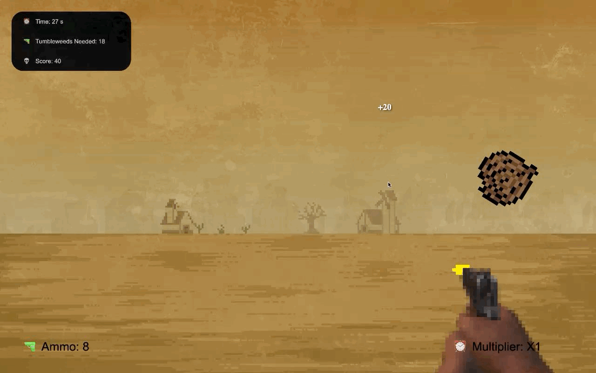

# Deadwood South - Carnival Shooter Game

Deadwood South is a point-and-click carnival shooter game developed as project for class. Step into the shoes of the sheriff of Deadwood South and test your shooting skills in this thrilling game set in the Wild West. Created with HTML, CSS and Javascript.

## Story
Play as the sheriff of Deadwood South, gain your sheriff's license and take down the criminals of the town. Make sure not to shoot any civilians or the story may take an unexpected turn. There are 2 possible endings of the game. Reach the end to set a new high score! 

## Gameplay
A point-and-click style game, shoot moving targets by clicking on them before the timer ends. Reload with [R] when you're out of ammo. Your score will increase by hitting targets on each level, but make sure to not miss any shots as this will decrease your final score. Some levels can end before the timer reaches zero, try to complete these as fast as you can. There are 2 endings in this game, depending on your performance during certain levels. Try replaying level 2 if you haven't achieved the alternate ending.

  
  

## Assets
Some of the assets used contain free-to-use copyrighted material and have been included in their original form or modified to better fit the style of the game. Credit to the original creators of these assets:

- https://rudyfaile.com/2020/06/30/free-game-assets/
- https://www.freepik.com/premium-vector/wild-west-cowboy-game-character-animation-sprite_1764982.htm
- https://www.deviantart.com/akithefull/art/Gun-Pointed-At-Camera-PNG-943087203

Some art was made/modified using https://www.pixilart.com/draw
 
Sound effects & music by me. Made using https://jummbus.bitbucket.io/

## Where to play
Try it out at: https://svaldes04.github.io/Deadwood-South
(For best results run on Google Chrome)
